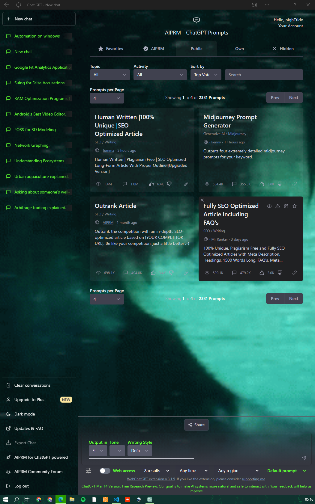
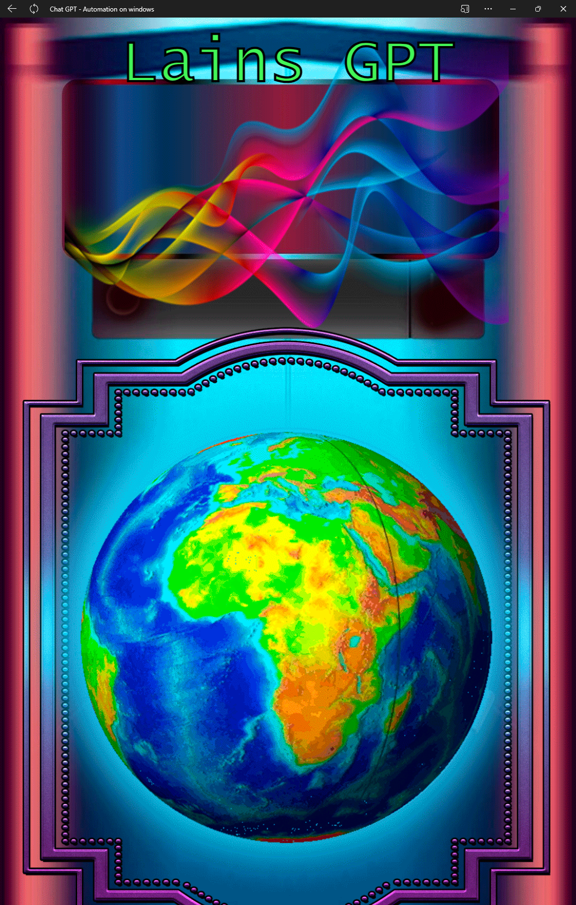

# chatGPLain
Install this script into the [Tampermonkey](https://www.tampermonkey.net/) browser extension and enjoy I nice themed experience on chatGPT.

You get a loading screen when you start the web app and lain will be flickering along side you behind your chat logs with GPT : )

### Chat

### Loading screen

